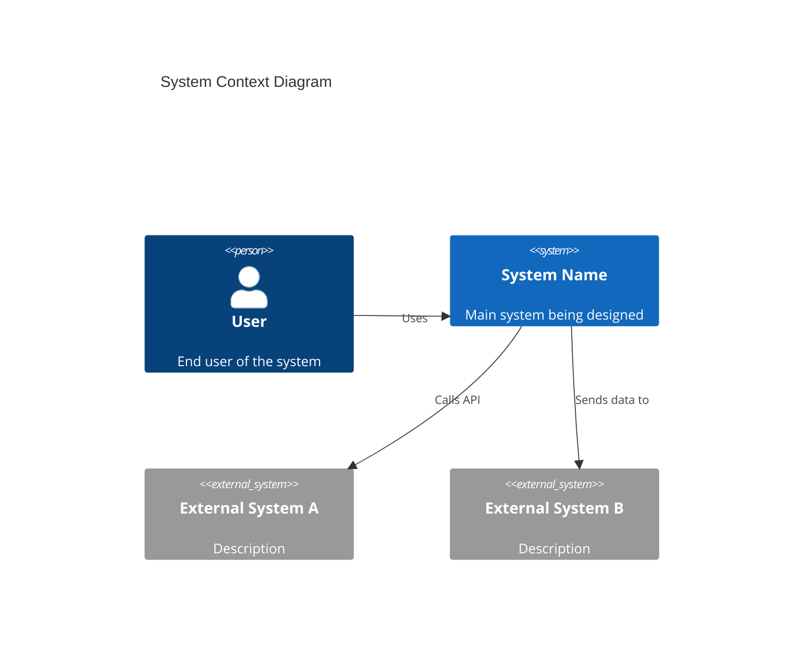
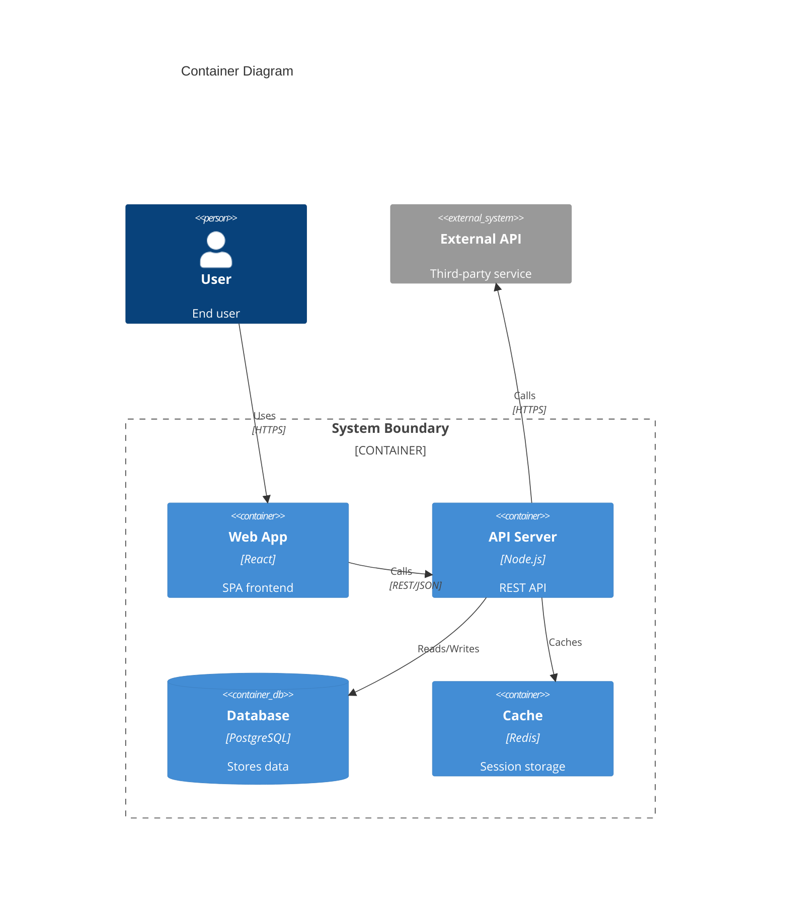
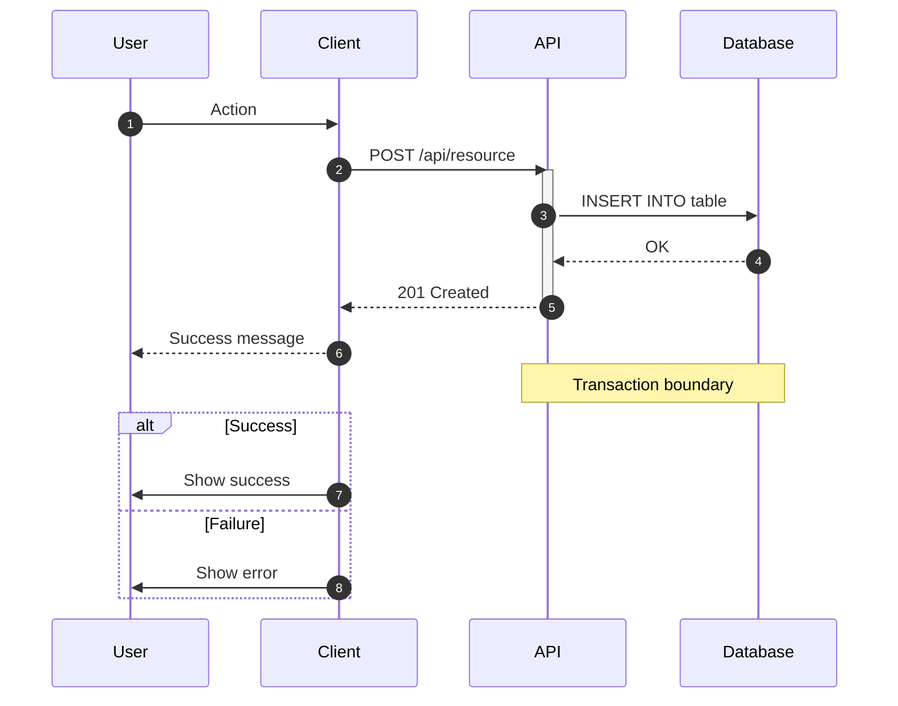
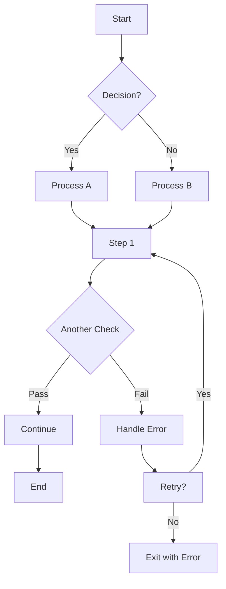
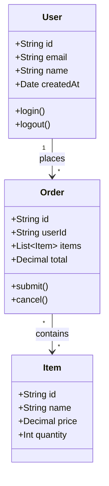
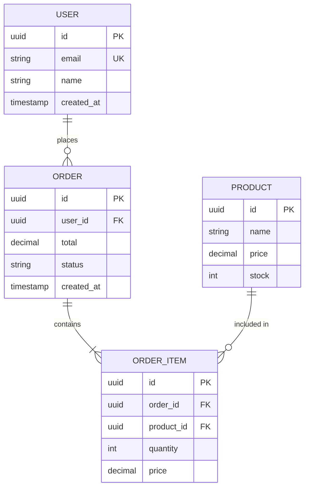
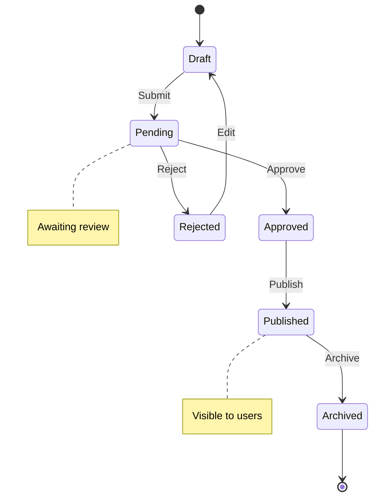
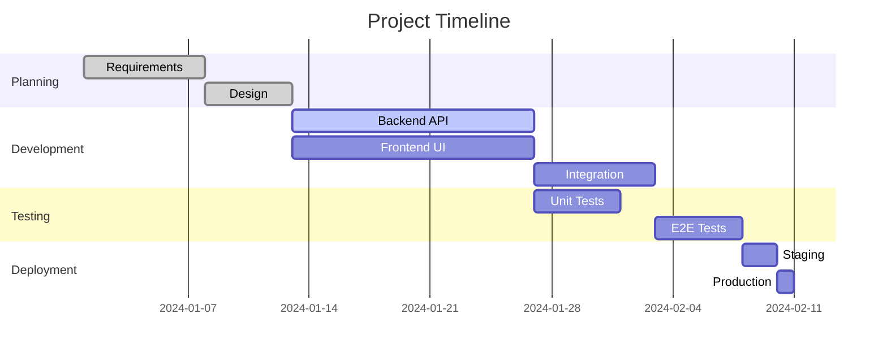
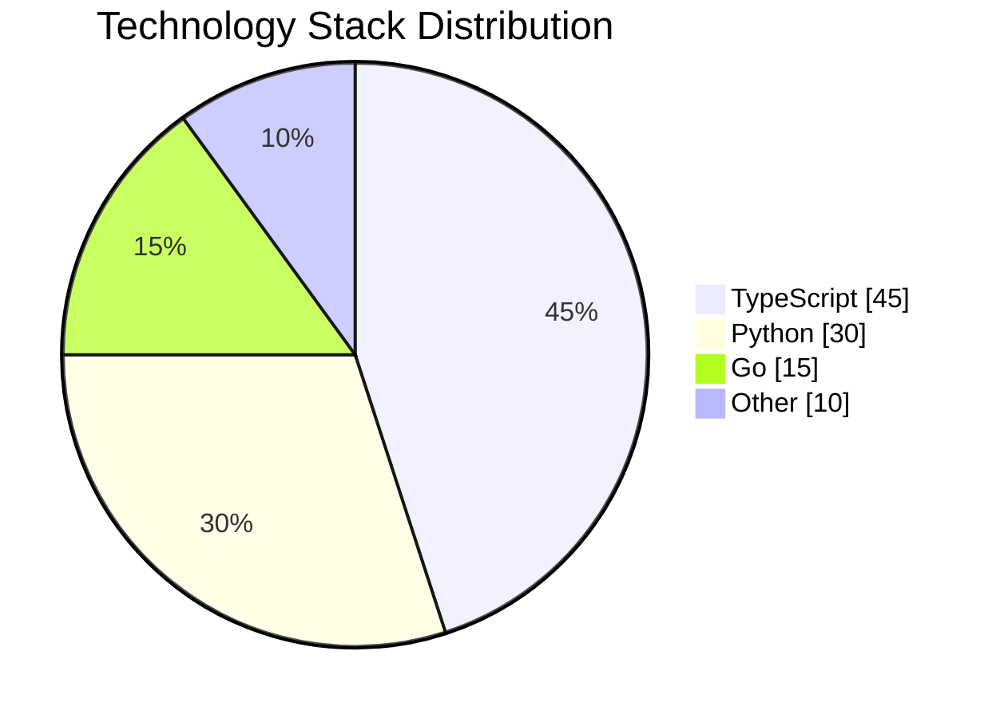

# Mermaid Diagram Templates

Quick-copy templates for common architecture diagrams.

---

## C4 Context Diagram

---

## C4 Container Diagram

---

## Sequence Diagram

---

## Flowchart

---

## Class Diagram

---

## Entity Relationship Diagram

---

## State Diagram

---

## Gantt Chart

---

## Pie Chart

---

## Usage Tips

1. **Keep it simple** — Diagrams should clarify, not complicate
2. **Use consistent naming** — Match names to actual code/components
3. **Add notes** — Explain non-obvious relationships
4. **Version control** — Store diagram source with code
5. **Validate syntax** — Use Mermaid Live Editor to test
