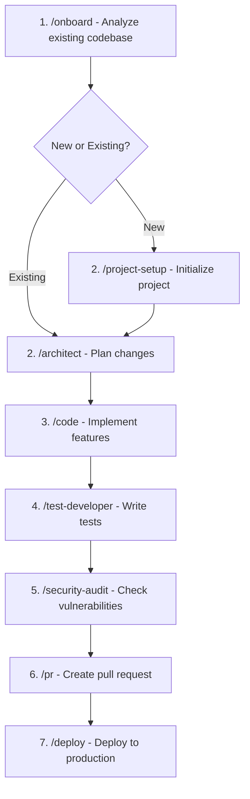

# Antigravity Agent Setup

A comprehensive toolkit for configuring Google Antigravity AI agents with custom skills, workflows, rules, and MCP (Model Context Protocol) servers.

## 🎯 What This Repo Does

This repository provides everything you need to supercharge your Antigravity AI coding assistant:

| Component | Count | Purpose |
|-----------|-------|---------|
| **Skills** | 18 | Reusable AI capabilities (frontend architecture, API building, etc.) |
| **Workflows** | 19 | Step-by-step automation sequences (architect, debug, deploy, etc.) |
| **Rules** | 6 | Behavioral constraints and quality guardrails |
| **MCP Servers** | 40+ | External tools via Docker MCP Gateway (databases, search, security, etc.) |

---

## 📋 Prerequisites

Before you begin, ensure you have:

- **Windows 10/11** (PowerShell 5.1+)
- **Git** installed and configured
- **Google Antigravity** installed (the AI coding assistant)

---

## 🚀 Complete Setup Guide (From Scratch)

Follow these steps in order to set up everything from a fresh install.

### Step 1: Install Docker Desktop with MCP Toolkit

1. **Download Docker Desktop** from [docker.com/products/docker-desktop](https://www.docker.com/products/docker-desktop)
2. **Run the installer** and follow the prompts
3. **Restart your computer** when prompted
4. **Open Docker Desktop** and complete the initial setup
5. **Enable MCP Toolkit** (Docker Extension):
   - Open Docker Desktop
   - Go to **Extensions** (left sidebar)
   - Search for **"MCP Toolkit"**
   - Click **Install**
   - Once installed, you'll see "MCP Toolkit" in your Docker Desktop sidebar

> [!TIP]
> The MCP Toolkit is what allows Antigravity to connect to Docker-based tools like databases, search engines, and security scanners.

### Step 2: Clone This Repository

```powershell
# Clone the repo
git clone https://github.com/TheThirdRail/antigravity-agent-setup.git

# Navigate to the folder
cd antigravity-agent-setup
```

### Step 3: Configure Your API Keys (Secrets)

Many MCP servers require API keys to function. We've made this easy with a template file.

1. **Copy the template:**

   ```powershell
   Copy-Item example.env .env
   ```

2. **Review the secrets guide:**
   Open [`secrets-acquisition-guide.md`](./secrets-acquisition-guide.md) for step-by-step instructions on getting each API key.

3. **Edit your `.env` file:**

   ```powershell
   notepad .env
   ```

   Fill in the API keys you've acquired. You don't need ALL of them—start with the essentials:
   - `GITHUB_PERSONAL_ACCESS_TOKEN` (for GitHub integration)
   - `BRAVE_API_KEY` (for web search)

> [!IMPORTANT]
> Never commit your `.env` file to version control. It's already in `.gitignore` for safety.

### Step 4: Add the MCP Gateway to Antigravity

1. **Open Docker Desktop** and ensure **MCP Toolkit** is active
2. **Add the catalog** by running:

   ```powershell
   docker mcp catalog add mcp-docker-stack local "${PWD}\MCP-Servers\mcp-docker-stack\docker-mcp-catalog.yaml"
   ```

3. **Verify** in Docker Desktop → MCP Toolkit → You should see your servers listed

### Step 5: Run the Setup Scripts

Navigate to the Scripts folder and run each script:

```powershell
cd Scripts
```

Run the scripts in this order (see [`script-commands.md`](./Scripts/script-commands.md) for full details):

```powershell
# 1. Clean up any deprecated items first
.\deprecation-checker.ps1

# 2. Install skills, workflows, and rules to Antigravity
.\install-skills.ps1
.\install-workflows.ps1
.\install-rules.ps1

# 3. Configure MCP secrets from your .env file
.\set-mcp-secrets.ps1

# 4. Enable lazy loading for MCP servers
.\setup_lazy_load.ps1
```

> [!TIP]
> Use `-DryRun` flag on any script to preview what it will do without making changes:
>
> ```powershell
> .\install-skills.ps1 -DryRun
> ```

### Step 6: Restart Antigravity

Close and reopen Google Antigravity to load your new skills, workflows, and rules.

---

## 🔧 Creating Your Own Skills, Rules, and Workflows

This repo includes meta-skills to help you create new agent components:

| Builder | Command | Creates |
|---------|---------|---------|
| **Skill Builder** | "I want to create a new skill for X" | Skills in `Agent/Skills/` |
| **Workflow Builder** | "I want to create a new workflow for X" | Workflows in `Agent/Workflows/` |
| **Rule Builder** | "I want to create a new rule for X" | Rules in `Agent/Rules/` |

### Quick Creation Examples

**Create a new skill:**

```
Ask Antigravity: "Use the skill-builder to create a new skill for database migration"
```

**Create a new workflow:**

```
Ask Antigravity: "Use the workflow-builder to create a /deploy-staging workflow"
```

**Create a new rule:**

```
Ask Antigravity: "Use the rule-builder to create a rule requiring all functions have docstrings"
```

After creating new components, run the appropriate install script to deploy them globally.

---

## 🎯 Order of Operations: New Project Setup

When starting a **new coding project** with Antigravity, follow this workflow:



### Recommended Workflow Commands

| Phase | Workflow | What It Does |
|-------|----------|--------------|
| **Start** | `/onboard` | Analyze and understand the codebase |
| **Plan** | `/architect` | Design features with maximum reasoning |
| **Setup** | `/project-setup` | Initialize new project structure |
| **Build** | `/code` | Implement with minimal discussion |
| **Test** | `/test-developer` | Write tests following TDD |
| **Secure** | `/security-audit` | Scan for vulnerabilities |
| **Review** | `/review` | Code review for quality |
| **Ship** | `/pr` → `/deploy` | Create PR and deploy safely |
| **Debug** | `/analyze` | Deep problem diagnosis |
| **Handoff** | `/handoff` | End-of-session documentation |

---

## 📁 Folder Structure

```
antigravity-agent-setup/
├── Agent/                    # Source files for agent configuration
│   ├── Skills/              # AI skill definitions (XML-in-Markdown)
│   │   └── metadata.schema.json  # JSON Schema for skill discovery
│   ├── Workflows/           # Workflow definitions (XML-in-Markdown)
│   └── Rules/               # Rule definitions (XML-in-Markdown)
├── MCP-Servers/             # Docker MCP server catalog
│   └── mcp-docker-stack/    # Custom MCP server definitions
├── Scripts/                 # PowerShell installation scripts
├── secrets-acquisition-guide.md  # How to get API keys
├── example.env              # Template for API keys and secrets
└── README.md
```

---

## 📜 Scripts Reference

| Script | Purpose |
|--------|---------|
| `install-skills.ps1` | Copies skills to `%LOCALAPPDATA%\Google\Antigravity\User Data\User\skills` |
| `install-workflows.ps1` | Copies workflows to `%LOCALAPPDATA%\Google\Antigravity\User Data\User\workflows` |
| `install-rules.ps1` | Copies rules to `~\.gemini\rules` |
| `set-mcp-secrets.ps1` | Sets Docker MCP secrets from `.env` file |
| `setup_lazy_load.ps1` | Enables MCP servers in Docker MCP Gateway |
| `deprecation-checker.ps1` | Removes deprecated items from global folders |

All scripts support `-DryRun` to preview changes without making them.

See [`Scripts/script-commands.md`](./Scripts/script-commands.md) for the full command reference.

---

## 🛠️ Included Skills (18)

### Development

| Skill | Description |
|-------|-------------|
| `frontend-architect` | UI component architecture, responsive design, accessibility (WCAG 2.1 AA) |
| `backend-architect` | API design, database modeling, security (OWASP) |
| `api-builder` | RESTful/GraphQL API design with OpenAPI |
| `architecture-planner` | System architecture diagrams and planning |
| `test-generator` | Unit/integration test generation (TDD) |
| `code-reviewer` | Code review with quality feedback |
| `database-optimizer` | Schema review, index optimization, query analysis |

### Productivity

| Skill | Description |
|-------|-------------|
| `documentation-generator` | Generate README, ADRs, API docs, changelogs |
| `research-capability` | Information gathering from docs and web |
| `performance-analyzer` | Profiling and optimization patterns |
| `git-commit-generator` | Conventional commit message generation |

### Agent Building

| Skill | Description |
|-------|-------------|
| `skill-builder` | Create new AI skills |
| `workflow-builder` | Create agent workflows |
| `rule-builder` | Create behavioral rules |
| `mcp-builder` | Create MCP server definitions |
| `mcp-manager` | Manage Docker MCP servers |
| `agent-builder` | Build complete agent configurations |

### Infrastructure

| Skill | Description |
|-------|-------------|
| `docker-ops` | Docker container management |
| `ci-cd-debugger` | Debug CI/CD pipelines |
| `security-checker` | Security audit and vulnerability scanning |

---

## 🔄 Included Workflows (19)

| Mode | Workflow | Description |
|------|----------|-------------|
| **Planning** | `/architect` | Design new features with MAX reasoning |
| **Execution** | `/code` | Implement with minimal discussion |
| **Debugging** | `/analyze` | Deep problem diagnosis |
| **Research** | `/research` | Deep web research and analysis |
| **Learning** | `/tutor` | Generate educational documentation |
| **Testing** | `/test-developer` | Test-driven development cycle |
| **Security** | `/security-audit` | Security vulnerability scanning |
| **Refactoring** | `/refactor` | Safe code refactoring |
| **Deployment** | `/deploy` | Safe production deployment with verification |
| **Performance** | `/performance-tune` | Systematic performance optimization |
| **Onboarding** | `/onboard` | Systematic codebase onboarding |
| **Handoff** | `/handoff` | Session handoff documentation |
| **Daily** | `/morning` | Daily startup routine |
| **PR** | `/pr` | Pull request preparation |
| **Review** | `/review` | Standalone code review |
| **Dependencies** | `/dependency-check` | Dependency audit |
| **Issues** | `/fix-issue` | GitHub issue resolution |
| **Project** | `/project-setup` | Initialize new project |

---

## 🐳 MCP Servers (40+)

The `docker-mcp-catalog.yaml` includes servers across these categories:

### Core Development

- **filesystem**, **github**, **git**, **desktop-commander**, **serena**

### Custom Indexing

- **scip-indexer** - Precise code navigation (Go to definition, Find references)
- **git-history** - Temporal search ("Why did this change?", "When was this introduced?")

### Search & Research

- **brave-search**, **context7**, **firecrawl**, **arxiv**, **pubmed**

### Databases

- **postgres**, **mongodb**, **sqlite**, **supabase**, **neon**, **qdrant** (vector)

### Security

- **gitleaks** - Secret detection (500+ patterns, no API key required)
- **sentry** - Error monitoring and observability
- **snyk**, **semgrep** - Vulnerability scanning

### Frontend & Design

- **react**, **vue**, **shadcn**, **magic**

### Task Management

- **todoist**, **linear**, **shrimp-task-manager**

### AI & Memory

- **memory**, **sequential-thinking**, **mem0**

---

## 🔐 Environment Variables

Copy `example.env` to `.env` and fill in credentials. Key variables:

| Variable | Service | Free Tier |
|----------|---------|-----------|
| `GITHUB_PERSONAL_ACCESS_TOKEN` | GitHub API | ✅ |
| `BRAVE_API_KEY` | Brave Search | ✅ 2k/month |
| `SENTRY_AUTH_TOKEN` | Error monitoring | ✅ 5k events |
| `QDRANT_API_KEY` | Vector database | ✅ 1GB |
| `SUPABASE_ACCESS_TOKEN` | BaaS | ✅ 500MB |

**See [`secrets-acquisition-guide.md`](./secrets-acquisition-guide.md) for step-by-step instructions to get each API key.**

---

## 📝 File Formats

### Skills, Workflows, Rules (XML-in-Markdown)

```markdown
---
name: component-name
description: Brief description
---

<skill name="component-name" version="1.0.0">
  <goal>What this component does</goal>
  <workflow>
    <step number="1" name="Step Name">
      <instruction>What to do</instruction>
    </step>
  </workflow>
</skill>
```

### Skill Metadata (metadata.json)

Optional JSON file for skill discovery:

```json
{
  "name": "frontend-architect",
  "version": "1.0.0",
  "category": "development",
  "keywords": ["frontend", "ui", "react"],
  "triggers": ["build UI component"]
}
```

See `Agent/Skills/metadata.schema.json` for the full schema.

---

## 🔧 Adding New Components

### Adding a New Skill

```powershell
# Use the skill-builder skill, or manually:
1. Create folder: Agent/Skills/my-skill/
2. Create SKILL.md (XML-in-Markdown format)
3. Optionally add metadata.json
4. Run: cd Scripts && .\install-skills.ps1
```

### Adding a New Workflow

```powershell
1. Create: Agent/Workflows/my-workflow.md
2. Use <workflow> root element
3. Run: cd Scripts && .\install-workflows.ps1
```

### Adding a New MCP Server

```yaml
# In MCP-Servers/mcp-docker-stack/docker-mcp-catalog.yaml
my-server:
  dateAdded: "2026-01-31T00:00:00Z"
  description: What it does
  title: Display Name
  type: server
  image: node:20-slim
  command: [npx, -y, package-name]
  secrets:
    - name: my-server.key
      env: MY_API_KEY
```

---

## 📄 License

MIT License - feel free to use, modify, and distribute.

## 🤝 Contributing

1. Fork the repository
2. Create a feature branch
3. Make your changes
4. Submit a pull request

---

**Built for Google Antigravity** | Supercharge your AI coding assistant

*Last updated: 2026-02-03*
